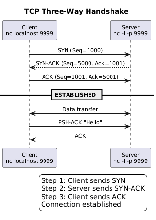

# PlantUML Diagrams for Computer Networks Course

## Overview

This collection contains **72 PlantUML diagrams** covering all 14 weeks of the Computer Networks seminar. Each diagram is strictly correlated with the concepts and experiments from each seminar.

## Structure

```
puml_diagrams/
├── week01/    # Basic tools, TCP/UDP, tshark (6 diagrams)
├── week02/    # Socket programming, Mininet (5 diagrams)
├── week03/    # Broadcast, Multicast, Tunnelling (5 diagrams)
├── week04/    # Data Link Layer, Ethernet, VLANs (5 diagrams)
├── week05/    # IP Addressing, CIDR, VLSM (5 diagrams)
├── week06/    # NAT, ARP, DHCP, ICMP, SDN (5 diagrams)
├── week07/    # Routing, OpenFlow, Forwarding (5 diagrams)
├── week08/    # Transport Layer, TCP, TLS, QUIC (5 diagrams)
├── week09/    # FTP, Binary Protocols, Sessions (5 diagrams)
├── week10/    # HTTP, REST, Docker Services (5 diagrams)
├── week11/    # Load Balancing, Nginx, Docker Compose (5 diagrams)
├── week12/    # Email Protocols, SMTP, MIME (5 diagrams)
├── week13/    # IoT Security, MQTT, Traffic Analysis (5 diagrams)
└── week14/    # Project Evaluation, Debugging (6 diagrams)
```

## Diagram Index by Week

### Week 1: Basic Diagnostic Tools and Traffic Capture
| File | Description |
|------|-------------|
| fig-diagnostic-workflow.puml | Network diagnostic layered approach |
| fig-tcp-handshake.puml | TCP three-way handshake sequence |
| fig-tcp-vs-udp.puml | TCP vs UDP packet comparison |
| fig-netcat-architecture.puml | Netcat client-server model |
| fig-tshark-workflow.puml | Traffic capture and analysis workflow |
| fig-socket-states.puml | Socket states observable with ss |

### Week 2: Socket Programming and Mininet
| File | Description |
|------|-------------|
| fig-socket-programming.puml | Python TCP socket API flow |
| fig-mininet-topology.puml | Basic Mininet topology |
| fig-udp-vs-tcp-sockets.puml | UDP vs TCP socket API comparison |
| fig-capture-correlation.puml | Correlating logs with packet captures |
| fig-threaded-server.puml | Concurrent TCP server model |

### Week 3: Broadcast, Multicast and Tunnelling
| File | Description |
|------|-------------|
| fig-udp-broadcast.puml | UDP broadcast communication |
| fig-udp-multicast.puml | UDP multicast with IGMP |
| fig-tcp-tunnel.puml | TCP tunnel/port forwarding |
| fig-broadcast-vs-multicast.puml | Unicast/Broadcast/Multicast comparison |
| fig-igmp-flow.puml | IGMP protocol message flow |

### Week 4: Data Link Layer
| File | Description |
|------|-------------|
| fig-ethernet-frame-detail.puml | Ethernet II frame structure |
| fig-switch-mac-learning.puml | Switch CAM table learning |
| fig-vlan-segmentation.puml | VLAN segmentation (802.1Q) |
| fig-data-link-sublayers.puml | LLC and MAC sublayers |
| fig-wifi-vs-ethernet.puml | Wi-Fi vs Ethernet frame comparison |

### Week 5: IP Addressing and Subnetting
| File | Description |
|------|-------------|
| fig-cidr-subnetting.puml | CIDR subnetting workflow |
| fig-ipv4-structure.puml | IPv4 address structure |
| fig-vlsm-allocation.puml | VLSM allocation example |
| fig-ip-ranges.puml | Private and special IP ranges |
| fig-ipv4-vs-ipv6.puml | IPv4 vs IPv6 comparison |

### Week 6: Network Support Protocols
| File | Description |
|------|-------------|
| fig-nat-pat-operation.puml | NAT/PAT operation |
| fig-arp-protocol.puml | ARP protocol flow |
| fig-dhcp-dora.puml | DHCP DORA process |
| fig-sdn-architecture.puml | SDN architecture |
| fig-icmp-messages.puml | ICMP message types |

### Week 7: Routing and SDN
| File | Description |
|------|-------------|
| fig-routing-types.puml | Static vs Dynamic routing |
| fig-openflow-flowtable.puml | OpenFlow flow table structure |
| fig-forwarding-decision.puml | Packet forwarding decision |
| fig-control-data-plane.puml | Control vs Data plane |
| fig-longest-prefix-match.puml | Longest prefix match routing |

### Week 8: Transport Layer
| File | Description |
|------|-------------|
| fig-tcp-header.puml | TCP header structure |
| fig-tcp-termination.puml | TCP connection termination |
| fig-tcp-sliding-window.puml | TCP sliding window |
| fig-tls-handshake.puml | TLS 1.3 handshake |
| fig-quic-vs-tcp.puml | QUIC vs TCP+TLS comparison |

### Week 9: File Protocols and Sessions
| File | Description |
|------|-------------|
| fig-ftp-architecture.puml | FTP protocol architecture |
| fig-binary-protocol.puml | Binary protocol structure |
| fig-session-layer.puml | Session layer concepts |
| fig-endianness.puml | Byte order/endianness |
| fig-docker-testing.puml | Docker multi-client testing |

### Week 10: Application Layer (HTTP)
| File | Description |
|------|-------------|
| fig-http-request-response.puml | HTTP request-response structure |
| fig-rest-maturity.puml | REST API maturity levels |
| fig-http2-features.puml | HTTP/2 vs HTTP/1.1 |
| fig-https-encryption.puml | HTTPS/TLS encryption |
| fig-docker-services-week10.puml | Docker Compose services |

### Week 11: Load Balancing
| File | Description |
|------|-------------|
| fig-load-balancing-algorithms.puml | LB algorithms comparison |
| fig-nginx-reverse-proxy.puml | Nginx reverse proxy architecture |
| fig-docker-compose-lb.puml | Docker Compose LB setup |
| fig-health-checks.puml | Health checks and failover |
| fig-sticky-sessions.puml | Session persistence |

### Week 12: Email Protocols
| File | Description |
|------|-------------|
| fig-email-architecture.puml | Email system architecture |
| fig-smtp-session.puml | SMTP session flow |
| fig-pop3-vs-imap.puml | POP3 vs IMAP comparison |
| fig-mime-structure.puml | MIME message structure |
| fig-email-security.puml | Email security (SPF/DKIM/DMARC) |

### Week 13: IoT Security
| File | Description |
|------|-------------|
| fig-iot-architecture.puml | IoT network architecture |
| fig-mqtt-protocol.puml | MQTT protocol flow |
| fig-iot-attack-vectors.puml | IoT attack vectors |
| fig-iot-defence-layers.puml | IoT defence layers |
| fig-iot-traffic-analysis.puml | IoT traffic analysis |

### Week 14: Project Evaluation
| File | Description |
|------|-------------|
| fig-project-presentation.puml | Presentation structure |
| fig-evaluation-rubric.puml | Evaluation rubric |
| fig-blooms-taxonomy.puml | Defence questions by level |
| fig-typical-architecture.puml | Typical project architecture |
| fig-debugging-workflow.puml | Debugging workflow |
| fig-evidence-artefacts.puml | Evidence and artefacts |

## Generating PNG Images

### A4 Format Generation (Recommended)

Generate all diagrams in A4 format with automatic orientation detection:

```bash
python3 generate_a4.py --dpi 150 --output-dir ./png_a4
```

This script:
- **Auto-detects orientation** (portrait ↕ or landscape ↔) for each diagram
- Generates at proper A4 dimensions
- Preserves week folder structure

**DPI Options:**
| DPI | Portrait Size | Landscape Size | Use Case |
|-----|---------------|----------------|----------|
| 72  | 595 × 842     | 842 × 595      | Web/preview |
| 96  | 794 × 1123    | 1123 × 794     | Screen |
| 150 | 1240 × 1754   | 1754 × 1240    | **Default** |
| 300 | 2480 × 3508   | 3508 × 2480    | Print quality |

**Orientation Detection Logic:**
| Portrait ↕ | Landscape ↔ |
|------------|-------------|
| Sequence diagrams | Component diagrams |
| Activity workflows | Architecture layouts |
| Swimlane diagrams | Class diagrams |
| State machines | Nested rectangles |

### Quick Start (Original Size)

The simplest way to generate all PNG images:

```bash
# Simple script with auto-download of PlantUML JAR
python3 generate_png_simple.py
```

Or use the Bash wrapper:

```bash
./generate_all.sh
```

### Advanced Usage

The full-featured generator script supports multiple methods:

```bash
# Auto-detect best method
python3 generate_diagrams.py

# Use HTTP server (no Java needed)
python3 generate_diagrams.py --method http

# Use Docker
python3 generate_diagrams.py --method docker

# Generate SVG instead of PNG
python3 generate_diagrams.py --format svg

# Parallel generation (faster for HTTP method)
python3 generate_diagrams.py --method http --parallel 8

# Verbose output
python3 generate_diagrams.py --verbose

# Dry run (show what would be done)
python3 generate_diagrams.py --dry-run
```

### Manual Generation

Using PlantUML CLI directly:
```bash
java -jar plantuml.jar week01/*.puml
```

Using Docker:
```bash
docker run --rm -v $(pwd):/data plantuml/plantuml /data/week01/*.puml
```

### Requirements

| Method | Requirements |
|--------|--------------|
| **JAR** (default) | Java 8+, PlantUML JAR (auto-downloaded) |
| **HTTP** | Internet connection only |
| **Docker** | Docker installed and running |

### Integration with Markdown

```markdown

```

### Styling

All diagrams use consistent styling:
- White background
- No shadows
- Rounded corners (12px)
- Arial font (11-14pt)
- Colour-coded elements

## Language

All diagrams are in **British English** (without commas before "and").

## Author

Generated for ASE-CSIE Computer Networks Course
